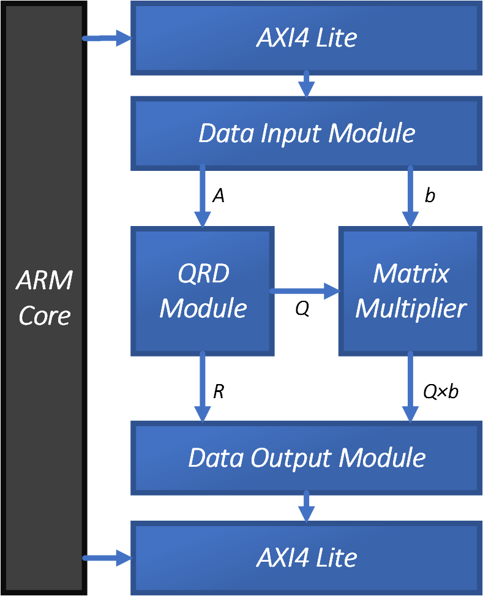

# ELEC522_Advanced_VLSI_Design

Updated: 12/14/2022

- #### Design a linear equation solver using ZYNQ

1. **ELEC_522_Proj_1_Sysgen_Intro / CUDA Intro** 
2. **ELEC_522_Proj_2_Matrix_Mult on FPGA / GPU**
3. **ELEC_522_Proj_3_Vivado_HLS_Matrix_Mult** 
4. **ELEC_522_Proj_4_Vivado_HLS_CORDIC** 
5. **ELEC_522_Proj_5_QR_Array** 
6. **ELEC_522_Proj_6_4x4_Linear_System_Solver** 

